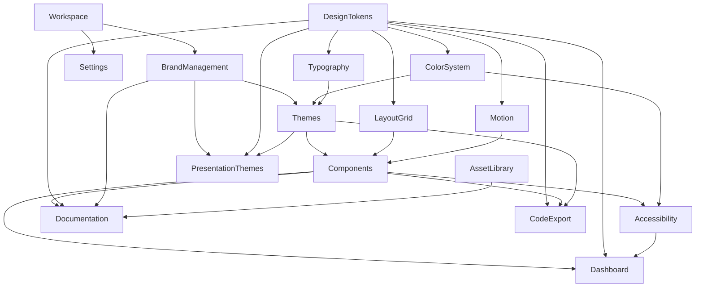

# Product Architecture: Design System Studio

This document defines the high-level functional architecture for Design System Studio as a standalone SaaS product. It outlines the modular decomposition, core data concepts, module relationships, and proposed application navigation.

---

## 1. System Modules

### Dashboard & Analytics
- **Purpose**: Provides a bird's-eye view of design system health, token usage metrics, component adoption, version history, and quick access to recent work.
- **Primary Users**: Design Leads, Engineering Managers, Product Managers, System Maintainers.
- **Key Capabilities**: 
  - Overview of total design tokens, components, and documentation coverage.
  - Health checks (WCAG compliance rate, hardcoded style flags, orphan tokens).
  - Activity feed of recent token edits and release deployments.
- **Dependencies**: Design Tokens, Components, Accessibility.
- **Future Expansion**: Enterprise analytics dashboards showing component usage across connected production code repositories.

### Brand Management
- **Purpose**: Establishes upper-level brand identity, voice guidelines, logos, asset guidelines, and global multi-brand hierarchy.
- **Primary Users**: Brand Designers, Creative Directors, Marketing Teams.
- **Key Capabilities**: 
  - Centralized storage for core logos, mark variations, and visual identity motifs.
  - Definition of brand voice, writing guidelines, and imagery rules.
  - Multi-brand architecture configuration (parent brand vs. sub-brands).
- **Dependencies**: Asset Library.
- **Future Expansion**: Automated brand asset transformation pipelines (SVG to multi-format raster/vector variants).

### Themes
- **Purpose**: Manages multi-theme layers, mode switching (Light, Dark, High Contrast), and dynamic context overrides.
- **Primary Users**: Product Designers, UI Designers, Frontend Engineers.
- **Key Capabilities**: 
  - Creation and editing of theme variants (e.g., Light, Dark, Enterprise Dark, OLED).
  - Mapping primitive tokens to dynamic semantic theme roles.
  - Real-time theme preview and side-by-side mode comparison.
- **Dependencies**: Design Tokens, Color System.
- **Future Expansion**: Contextual runtime theme switching based on time of day, user accessibility settings, or tenant branding.

### Color System
- **Purpose**: Generates, structures, and audits harmonious color scales, palette primitives, and semantic surface mappings.
- **Primary Users**: UI Designers, Product Designers, Accessibility Specialists.
- **Key Capabilities**: 
  - Algorithmic and manual scale generation (HSL/OKLCH color space mapping).
  - Primitive palette creation (Brand, Neutral, Semantic feedback shades).
  - Automated contrast ratio checks across background/foreground surface pairs.
- **Dependencies**: Design Tokens, Accessibility.
- **Future Expansion**: Dynamic color scale generation based on brand seed color inputs.

### Typography
- **Purpose**: Defines typography scales, font family pairings, line-height rules, and text style tokens.
- **Primary Users**: UI Designers, Frontend Engineers.
- **Key Capabilities**: 
  - Type scale scale generators (Modular scales: Minor Third, Major Third, Golden Ratio).
  - Font family declarations (Display, Body, Monospace, Variable Fonts).
  - Text style role mappings (Headings, Body text, Code blocks, Labels).
- **Dependencies**: Design Tokens.
- **Future Expansion**: Optical size tuning and custom font hosting/subsetting tools.

### Icons
- **Purpose**: Manages icon sets, SVG optimization, icon tokens, and usage guidelines.
- **Primary Users**: Product Designers, UI Designers, Frontend Engineers.
- **Key Capabilities**: 
  - Icon library cataloging and category grouping.
  - Bulk SVG import, cleaning, and token-based coloring.
  - Searchable icon picker with copyable component snippets.
- **Dependencies**: Asset Library, Design Tokens.
- **Future Expansion**: Automatic icon font and SVG sprite bundle generator.

### Design Tokens
- **Purpose**: Serves as the foundational engine for all design values (colors, spacing, radii, shadows, typography, motion).
- **Primary Users**: Design System Engineers, Product Designers, Technical Architects.
- **Key Capabilities**: 
  - Multi-tier token architecture (Global Primitives $\rightarrow$ Semantic Tokens $\rightarrow$ Component Tokens).
  - Token editing with live visual feedback.
  - W3C DTCG Token Specification export/import support.
- **Dependencies**: None (Foundational layer).
- **Future Expansion**: Versioned token branch merging and conflict resolution workflows.

### Components
- **Purpose**: Cataloging, interactive staging, state management testing, and documentation of UI primitives.
- **Primary Users**: Frontend Engineers, UI Designers, Design System Engineers.
- **Key Capabilities**: 
  - Interactive component playground with configurable prop controls.
  - Component state matrix preview (Default, Hover, Active, Focus, Disabled).
  - Token binding inspector for every visual property.
- **Dependencies**: Design Tokens, Themes, Typography, Color System, Accessibility.
- **Future Expansion**: Automated visual regression testing across component states.

### Motion
- **Purpose**: Defines animation durations, easing curves, transition tokens, and interactive micro-interactions.
- **Primary Users**: Motion Designers, Frontend Engineers, UI Designers.
- **Key Capabilities**: 
  - Motion token definitions (Durations: fast, base, slow; Easing curves: cubic-bezier presets).
  - Live preview curve visualizers and interaction playbacks.
  - Reduced motion accessibility fallback rules.
- **Dependencies**: Design Tokens, Accessibility.
- **Future Expansion**: Interactive keyframe choreography builder for complex component sequences.

### Layout & Grid
- **Purpose**: Configures spatial tokens, grid systems, container break points, and layout presets.
- **Primary Users**: Product Designers, Frontend Engineers.
- **Key Capabilities**: 
  - Spacing scale definitions (4pt / 8pt spatial scales).
  - Radius and elevation token hierarchies.
  - Breakpoint grid definitions (Mobile, Tablet, Desktop, Wide).
- **Dependencies**: Design Tokens.
- **Future Expansion**: Flexbox and CSS Grid layout preset generators.

### Accessibility (a11y)
- **Purpose**: Audits, enforces, and documents accessibility compliance across tokens, colors, typography, and components.
- **Primary Users**: Accessibility Auditors, Product Designers, QA Engineers.
- **Key Capabilities**: 
  - Automated WCAG 2.1 AA/AAA contrast matrix checks.
  - Focus ring and state indicator visibility audits.
  - Screen reader semantic markup guidelines for components.
- **Dependencies**: Color System, Typography, Components, Design Tokens.
- **Future Expansion**: Simulated vision deficiency filters (Protanopia, Deuteranopia, Tritanopia) across live components.

### Documentation
- **Purpose**: Authors and publishes interactive design system guidelines, usage rules, and component documentation.
- **Primary Users**: Design System Writers, Product Designers, Frontend Engineers.
- **Key Capabilities**: 
  - Rich text and Markdown editor for usage guidelines, dos and don'ts.
  - Embeddable live component previews, token swatches, and interactive widgets.
  - Public/Private documentation publishing.
- **Dependencies**: Components, Design Tokens, Brand Management, Asset Library.
- **Future Expansion**: Multi-language documentation localization.

### Code Export
- **Purpose**: Generates production-ready code outputs, token artifacts, and framework definitions.
- **Primary Users**: Frontend Engineers, DevOps, Build Systems.
- **Key Capabilities**: 
  - Export tokens to CSS Variables, JSON, SCSS, TypeScript, Tailwind Config.
  - Export component definitions to React, Web Components, and HTML snippets.
  - One-click copy or bundle download.
- **Dependencies**: Design Tokens, Components, Themes.
- **Future Expansion**: Direct GitHub PR automation for token update distributions.

### Asset Library
- **Purpose**: Central repository for media assets, brand illustrations, logos, and font files.
- **Primary Users**: Brand Designers, Content Creators, UI Designers.
- **Key Capabilities**: 
  - Asset uploading, tagging, and folder organization.
  - Asset metadata management and license tracking.
- **Dependencies**: None.
- **Future Expansion**: CDN-hosted asset serving for connected web apps.

### Presentation Themes
- **Purpose**: Enables teams to create design-system-aligned presentation decks, executive summaries, and brand showcases.
- **Primary Users**: Product Managers, Design Leaders, Executives, Agencies.
- **Key Capabilities**: 
  - Slide template catalog utilizing active brand tokens and components.
  - Theme-aware slide deck previews and exports.
- **Dependencies**: Brand Management, Design Tokens, Themes, Asset Library.
- **Future Expansion**: Exporting presentations directly to PDF, PPTX, or interactive web slideshows.

### Settings & Workspace
- **Purpose**: Manages user roles, permissions, workspace settings, integrations, and subscription tiering.
- **Primary Users**: Workspace Administrators.
- **Key Capabilities**: 
  - Team member management and role-based permissions (Viewer, Editor, Admin).
  - Integration keys and API token management.
- **Dependencies**: None.
- **Future Expansion**: SSO/SAML single sign-on integration for Enterprise tiers.

---

## 2. Module Relationships



- **Foundational Layer**: `Design Tokens` supplies raw atomic values to `Color System`, `Typography`, `Motion`, and `Layout & Grid`.
- **Composition Layer**: `Color System` and `Typography` feed into `Themes`. `Themes`, `Motion`, and `Layout` combine to build `Components`.
- **Validation & Output Layer**: `Components` and `Design Tokens` supply data to `Accessibility` (validation), `Documentation` (publishing), `Code Export` (delivery), and `Presentation Themes` (showcasing).
- **Executive Layer**: `Dashboard` gathers status metrics from `Components`, `Design Tokens`, and `Accessibility`.

---

## 3. Core Data Model

The domain logic is built around the following fundamental product entities:

- **Workspace**: The root container for an organization, holding users, billing settings, and brands.
- **Brand**: Represents a corporate or product identity. Owns assets, core guidelines, and associated themes.
- **Theme**: A specific visual execution mode (e.g., "Corporate Light", "Cyber Dark") that maps semantic roles to design tokens.
- **Token**: An individual design decisions key-value pair containing metadata (Name, Category, Raw Value, Resolved Value, Description, Tier).
- **Color Palette**: A curated collection of shade steps and color scales (e.g., `Brand Blue 50-900`) built in specific color spaces.
- **Typography Scale**: A structured set of font sizes, line heights, font weights, and text roles.
- **Component**: A reusable UI element definition comprising props, variant matrices, slot structures, and token bindings.
- **Presentation Theme**: A collection of slide templates engineered with active brand tokens and presentation layouts.
- **Asset**: A binary or vector file (Logo, Font, Illustration, Icon) stored with tags, dimension metadata, and usage constraints.
- **Export**: A generated bundle configuration defining target formats (e.g., React JS + CSS Variables) and output options.

---

## 4. Future Modules (Post-V1 Expansion)

These modules are deliberately excluded from V1 to maintain focus, but are designed to integrate seamlessly into future product releases:

1. **Figma Bi-Directional Sync**: Plugin engine that synchronizes tokens and component states live between Figma Variables and Design System Studio.
2. **Repository Sync (GitHub / GitLab Integration)**: Automated Git bot that pushes token updates directly as PRs/MRs to production software repositories.
3. **Multi-Tenant System Inheritance**: Allows enterprise orgs to publish a base "Core Design System" and let sub-teams inherit and override tokens for child brands.
4. **Visual Regression Testing Suite**: Automated snapshot testing engine that renders components across browser engines whenever tokens update.
5. **AI Component & Spec Generator**: AI module that parses natural language or image mockups to draft component token bindings and documentation rules.

---

## 5. Recommended Navigation Structure

A clean, predictable navigation hierarchy organized for modern SaaS usability:

```text
├── Workspace Header
│   ├── Workspace Selector
│   ├── Brand Switcher
│   └── Quick Search / Command Palette (Cmd + K)
│
├── Main Sidebar Navigation
│   ├── 📊 Dashboard
│   │
│   ├── 🎨 FOUNDATIONS
│   │   ├── Design Tokens (Global, Semantic, Component Tiers)
│   │   ├── Color System (Palettes, Surface Roles, Contrast Auditor)
│   │   ├── Typography (Font Families, Modular Scales, Styles)
│   │   ├── Layout & Spacing (Grid, Spacing Scale, Radii, Shadows)
│   │   ├── Motion (Durations, Curves, Micro-interactions)
│   │   └── Icons (Icon Library, SVG Management)
│   │
│   ├── 🧱 COMPONENTS
│   │   ├── Component Library (Playground, Props, States Matrix)
│   │   └── Accessibility Audit (WCAG Checks, Focus Management)
│   │
│   ├── 🌓 THEMES
│   │   ├── Theme Manager (Light, Dark, Custom Variants)
│   │   └── Brand Identity (Logos, Voice, Motifs)
│   │
│   ├── 📚 DOCUMENTATION & SHOWCASE
│   │   ├── System Docs (Guidelines, Usage Rules, Release Notes)
│   │   ├── Presentation Decks (Executive Summaries, Slide Themes)
│   │   └── Asset Library (Media, Fonts, Vector Downloads)
│   │
│   └── ⚡ EXPORT & DEPLOY
│       ├── Code Generator (CSS, JSON, React, Web Components)
│       └── Integrations & Webhooks
│
└── Sidebar Footer
    ├── System Health Status (WCAG Pass Rate % / Token Count)
    └── Settings & Team Management
```
